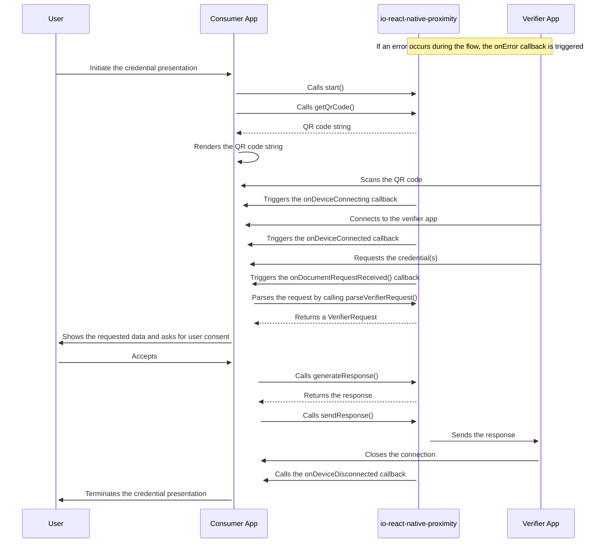

# @pagopa/io-react-native-proximity

This library provides a React Native module based on [https://github.com/pagopa/iso18013-android](iso18013-android) and [https://github.com/pagopa/iso18013-ios](iso18013-ios) which allows mDL proximity presentation according to the
ISO 18013-5 standard and remote presentation according to the ISO 18013-7 standard.

## Installation

```sh
npm install @pagopa/io-react-native-proximity
```

## Usage

### `events`

This library emits the following events:
| Event | Payload | Description |
|---------------------------|--------------------------------|----------------------------------------------------------------------------------------------------------------------------------------------|
| onDeviceConnecting | undefined | Event dispatched when the verifier app is connecting |
| onDeviceConnected | undefined | Event dispatched when the verifier app is connected |
| onDocumentRequestReceived | { data: string } \| undefined | Event dispatched when the consumer app receives a new request, contained in the data payload. It can be parsed via the utility provided [src/schema.ts](here). |
| onDeviceDisconnected | undefined | Event dispatched when the verifier app disconnects. |
| onError | { error: string } \| undefined | Event dispatched when an error occurs which is contained in the error payload |

Listeners can be added using the `addListener` method and removed using the `removeListener` method:

```typescript
import { Proximity } from '@pagopa/io-react-native-proximity';

Proximity.addListener('onDeviceConnecting', () =>
  console.log('Device is connecting')
);

Proximity.removeListener('onDeviceConnecting');
```

### `start`

Starts the proximity flow and starts the bluetooth service. This method also accepts optional parameters to configure the initialization on Android, along with the possibility
to specify a certificates of array to verify the reader app.

```typescript
import { Proximity } from '@pagopa/io-react-native-proximity';

await Proximity.start();
```

### `getQrCodeString`

Returns the QR code string which contains a base64url encoded CBOR object which encodes the bluetooth engagement data.
It can be used to display the QR code in the UI which will be scanned by the verifier app.

```typescript
import { Proximity } from '@pagopa/io-react-native-proximity';

const qrCodeString = await Proximity.getQrCodeString();
console.log(qrCodeString);
```

### `generateResponse`

Generates a response that will be sent to the verifier app containing the requested documents.

```typescript
import { Proximity } from '@pagopa/io-react-native-proximity';

const response = await Proximity.generateResponse({
  documents: [
    {
      type: 'mDL',
      data: 'base64url-encoded-data',
    },
  ],
});
console.log(response);
```

### `sendResponse`

Sends the response generate by `generateResponse` to the verifier app.

```typescript
import { Proximity } from '@pagopa/io-react-native-proximity';

await Proximity.sendResponse(response);
```

### `sendErrorResponse`

Sends an error response to the verifier app. The supported error codes are defined in the Table 20 of the ISO 18013-5 standard and are coded in the `ErrorCode` enum.

```typescript
import { Proximity, ErrorCode } from '@pagopa/io-react-native-proximity';

await Proximity.sendErrorResponse({
  errorCode: ErrorCode.SESSION_ENCRYPTION,
  errorMessage: 'An error occurred while encrypting the session',
});
```

### `close`

Closes the QR engagement by releasing the resources allocated during the `start` method.
Before starting a new flow, it is necessary to call this method to ensure that the previous flow is properly closed.
The listeners can be removed using the `removeListener` method.

```typescript
import { Proximity } from '@pagopa/io-react-native-proximity';

await Proximity.close();
```

## Proximity Flow Schema 


## Contributing

See the [contributing guide](CONTRIBUTING.md) to learn how to contribute to the repository and the development workflow.

## License

MIT

---

Made with [create-react-native-library](https://github.com/callstack/react-native-builder-bob)
